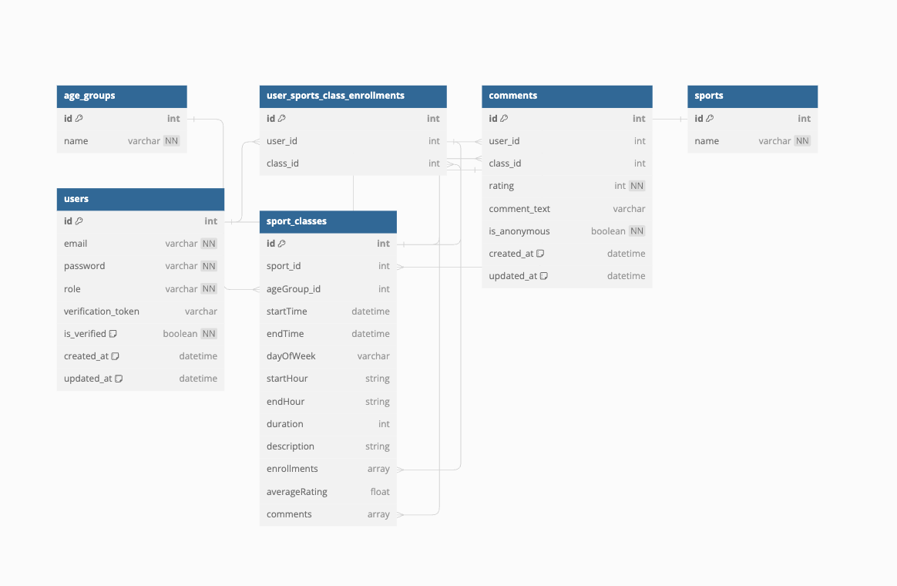

# Sports Complex Application

## Description

The Sports Complex Application is designed to manage sport classes, providing functionality for
- Create, view, update and delete users (last 3 - Admin only)
- Create, view, update and delete sports (Admin only)
- Create, view, update and delete Age groups (Admin only) 
- Create, view, update and delete Sport classes (CUD for Admin only)
- Create and update comments and ratings for each sport class while Admin only can view the comments

Database schema



## Prerequisites

Before running the application, ensure you have the following installed:

- Node JS
- [Docker](https://www.docker.com/products/docker-desktop)
- PostgreSQL (if not using Docker for database)


## Getting Started

Follow these steps to run the application:

1. Clone the repository:

    ```bash
    git clone https://github.com/your-username/sports-complex.git
    cd sports-complex
    ```

2. Create a `.env` file in the root directory by duplicating ``.env.example`` and populate it with your environment variables. Don't forget that variables in docker.compose must match these from `.env`:

    ```plaintext
    # APP
    PORT=3000
    NODE_ENV='development'
    API_URL='http://localhost'

    # DB
    DB_HOST='db'
    DB_PORT=5432
    DB_USERNAME='postgres'
    DB_PASSWORD='your_password'
    DB_DATABASE='your_database_name'

    # MAIL
    SENDGRID_API_KEY='your_sendgrid_api_key'
    SENDGRID_API_SENDER_EMAIL='sender@gmail.com'

    # JWT
    JWT_SECRET='your_jwt_secret'
    JWT_EXPIRY_TIME='15m'
    ```

3. Run the application using Docker Compose:

    ```bash
    docker-compose up --build
    ```

    This command will build the Docker images and start the containers for the application and database.

4. Access the application in your browser at `http://localhost:PORT`.

## Additional Information

- For development purposes, you can run the application in watch mode using the following command:

    ```bash
    npm run serve
    ```

- To stop the application, use:

    ```bash
    docker-compose down
    ```

## Contributing
- If you'd like to contribute to this project, feel free to fork the repository and submit a pull request.
- Feel free to reach on [LinkedIn](https://www.linkedin.com/in/drago-jelavi%C4%87-564b64180/) for any questions,suggestions or potential collaborations.

